

# PA4 Submission: TaskFlow Pipeline

Copy this file to <code style="color:#111827;background:#ddd6fe;padding:2px 4px;border-radius:4px;">SUBMISSION.md</code>. Put every screenshot in <code style="color:#111827;background:#ddd6fe;padding:2px 4px;border-radius:4px;">docs/</code>, embed it under the correct task, and write a short description below each image explaining what it proves. The grader should not need any file outside this repository.

## Student Information

| Field | Value |
|---|---|
| Name | Muhammad Abdur Rehman |
| Roll Number | 24030003 |
| GitHub Repository URL | https://github.com/abdurrehmanab92/CS487-PA4 |
| Resource Group | `rg-sp26-24030003` |
| Assigned Region | `ukwest` |

## Evidence Rules

- Use relative image paths, for example: ``.
- Every image must have a 1-3 sentence description below it.
- Azure Portal screenshots must show the resource name and enough page context to identify the service.
- CLI screenshots must show the command and output.
- Mask secrets such as function keys, ACR passwords, and storage connection strings.

## Task 1: App Service Web App (15 points)

### Evidence 1.1: Forked Repository

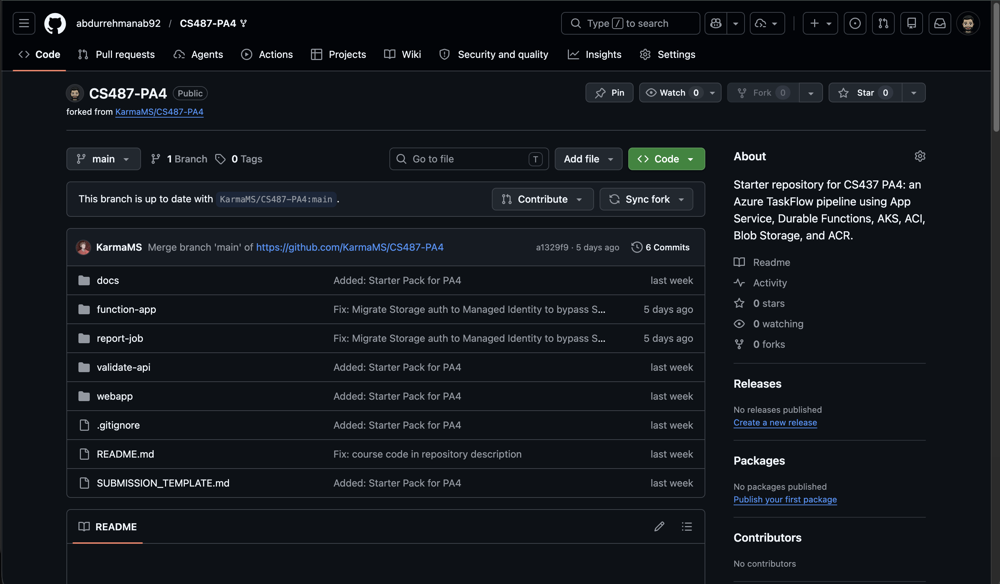

Description: This is the personal fork of the CS487-PA4 starter repository under the GitHub account `abdurrehmanab92`.

### Evidence 1.2: App Service Overview

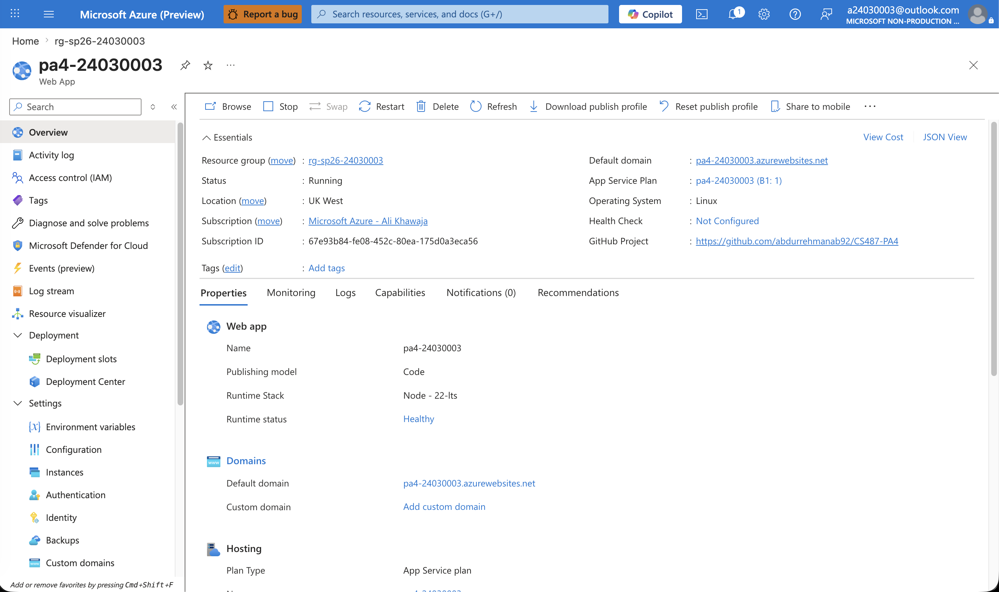

Description: The Web App `pa4-24030003` is deployed in resource group `rg-sp26-24030003`, region UK West, running on the Linux B1 App Service Plan with Node 22 LTS runtime. The status shows Running and the public URL is `https://pa4-24030003.azurewebsites.net`.

### Evidence 1.3: Deployment Center / GitHub Actions

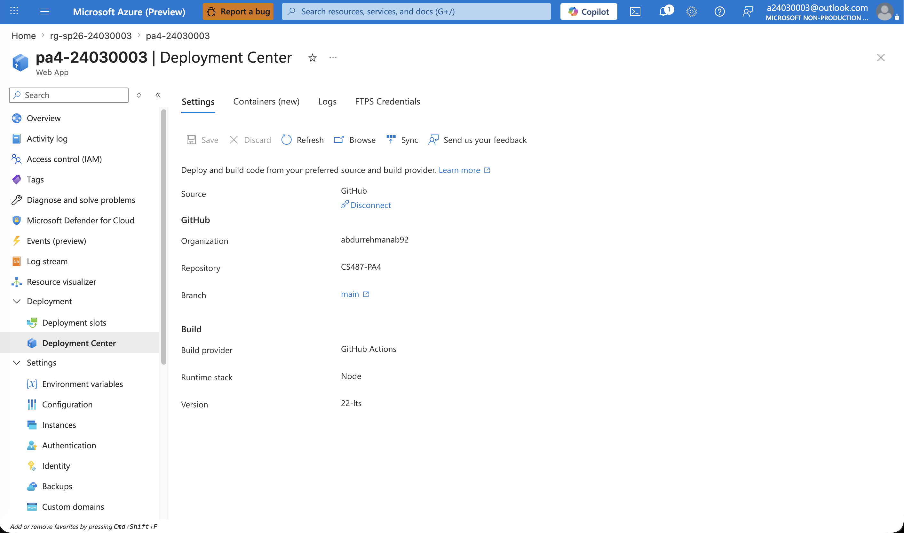

Description: The Deployment Center shows the Web App is connected to the `main` branch of the GitHub fork `abdurrehmanab92/CS487-PA4`.

### Evidence 1.4: Live Web UI

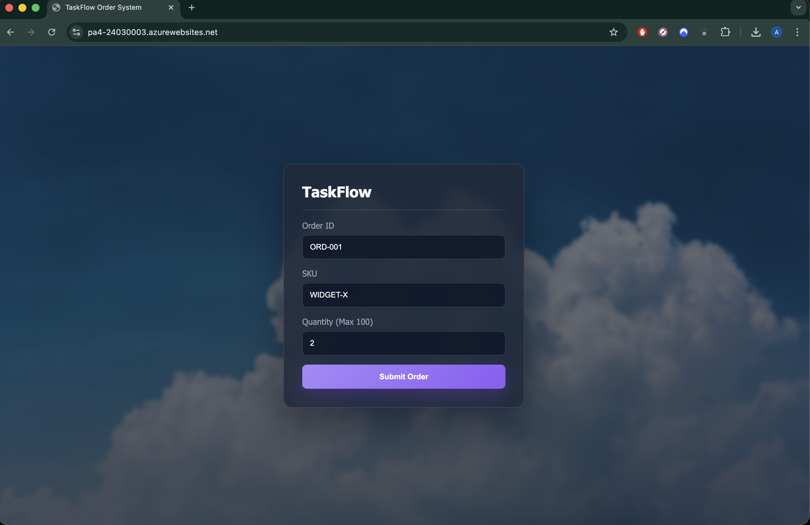

Description: The TaskFlow dashboard is loading successfully over HTTPS at `pa4-24030003.azurewebsites.net`.

### Evidence 1.5: Application Settings

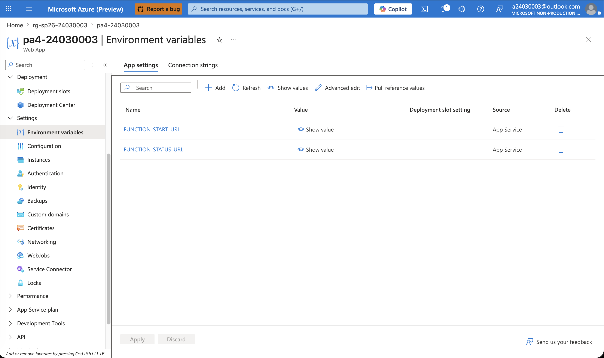

Description: The Web App environment variables show `FUNCTION_START_URL` and `FUNCTION_STATUS_URL` configured.

---

## Task 2: Azure Container Registry (15 points)

### Evidence 2.1: ACR Overview

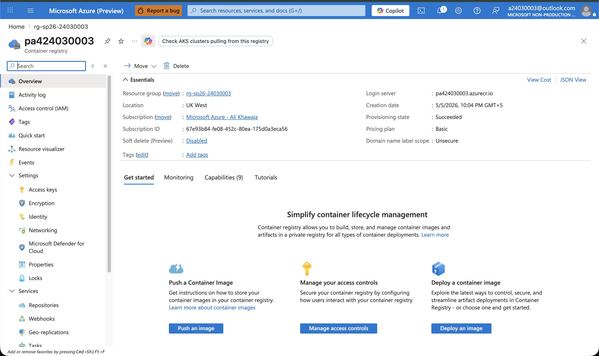

Description: The Azure Container Registry `pa424030003` is provisioned in resource group `rg-sp26-24030003`, UK West region.

### Evidence 2.2: Docker Builds

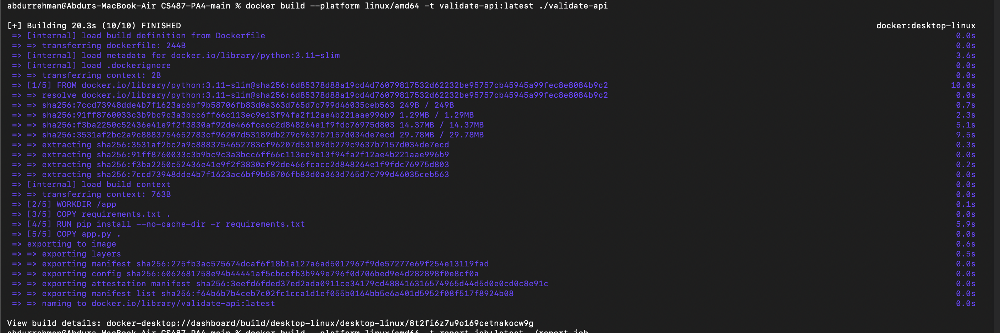
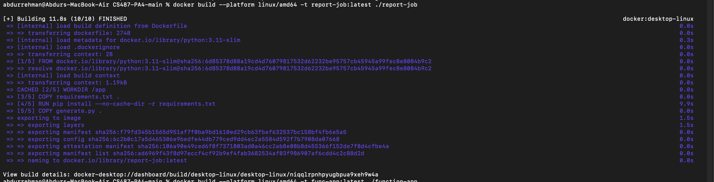
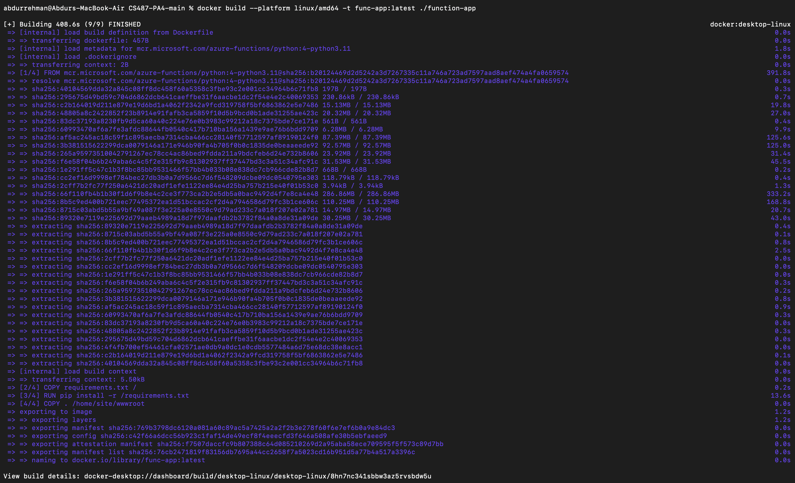

Description: All three images were built locally with `--platform linux/amd64` flag. `validate-api` was built from `./validate-api`, `report-job` from `./report-job`, and `func-app` from `./function-app`.

### Evidence 2.3: Local Validator Test

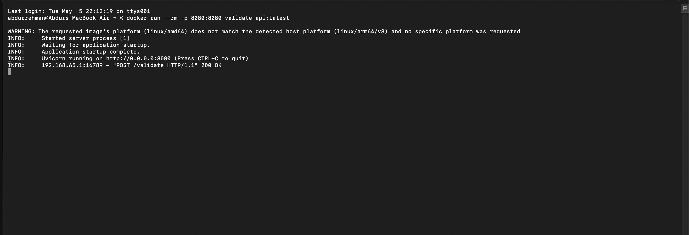
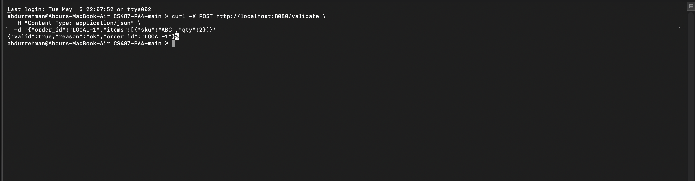

Description: The `validate-api` container was tested locally by sending a POST request to `http://localhost:8080/validate`. The response returned `{"valid": true, "reason": "ok"}` confirming the FastAPI validator is working correctly.

### Evidence 2.4: ACR Push

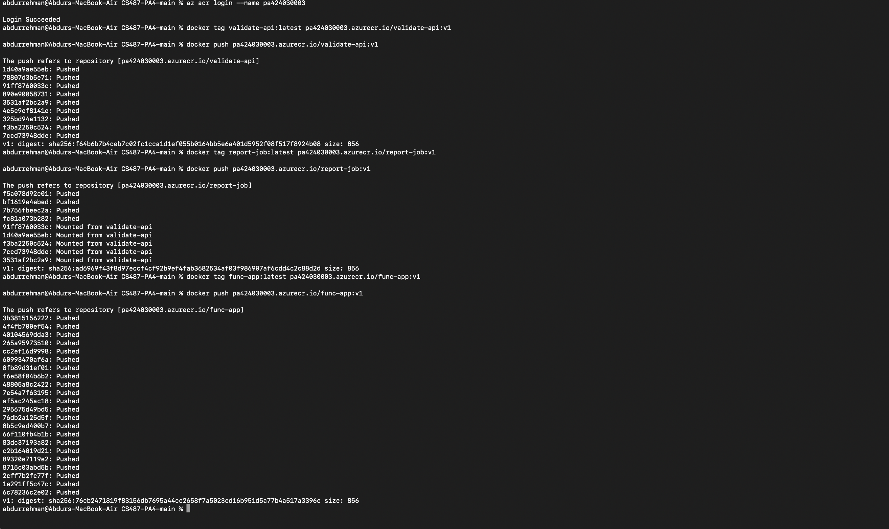

Description: All three images were tagged and pushed to `pa424030003.azurecr.io`. The push output confirms successful upload of `validate-api:v1`, `report-job:v1`, and `func-app:v1`.

### Evidence 2.5: ACR Repositories

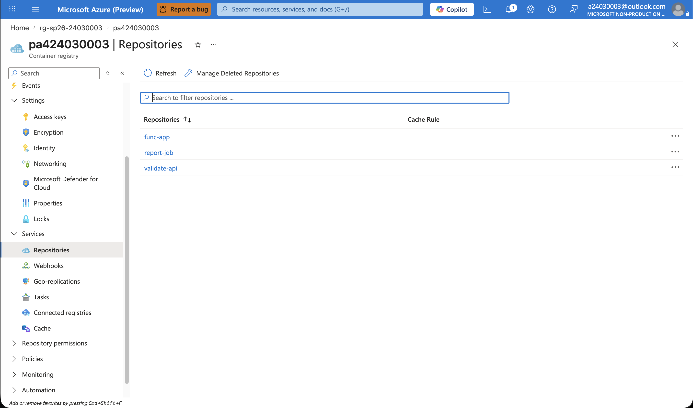

Description: The `az acr repository list` output confirms all three repositories — `validate-api`, `report-job`, and `func-app` — exist in the registry.

---

## Task 3: Durable Function Implementation (12 points)

### Evidence 3.1: Completed Function Code

[function_app.py](function-app/function_app.py)

Description: The orchestrator chains two activities, `validate_activity` makes an HTTP POST to the AKS validator, if valid, `report_activity` uses the Azure SDK to create a Container Instance that generates a PDF and uploads it to Blob Storage. The orchestrator checkpoints state between activities so a failure in `report_activity` does not re-run `validate_activity`.

### Evidence 3.2: Local Function Handler Listing

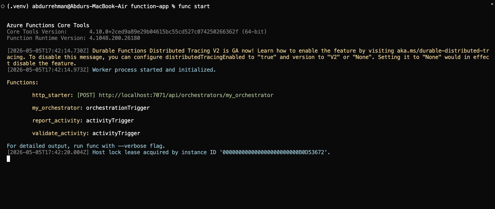

Description: The `func start` output shows all four Durable Function handlers registered.

---

## Task 4: Function App Container Deployment (8 points)

### Evidence 4.1: Function App Container Configuration

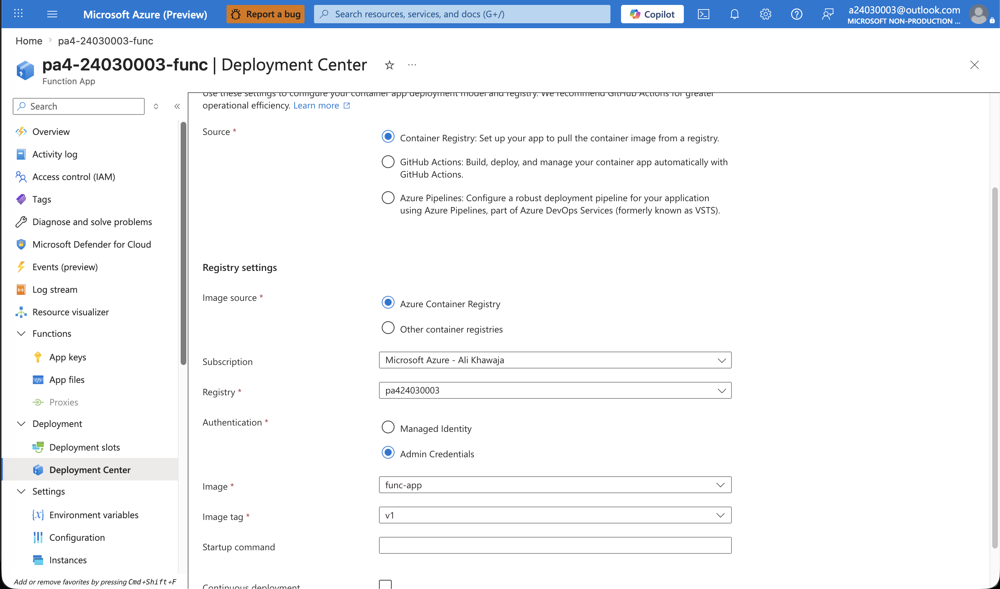

Description: The Function App `pa4-24030003-func` Deployment Center shows the container image source configured as `pa424030003.azurecr.io/func-app:v1`.

### Evidence 4.1: Function List in Portal

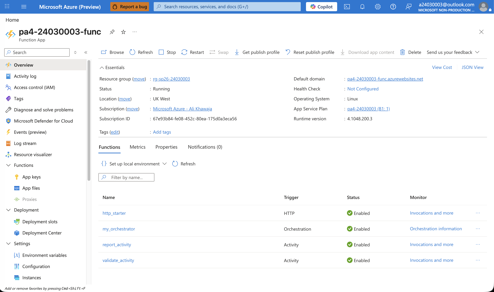

Description: The Function list in the portal.

### Evidence 4.3: Orchestration Smoke Test

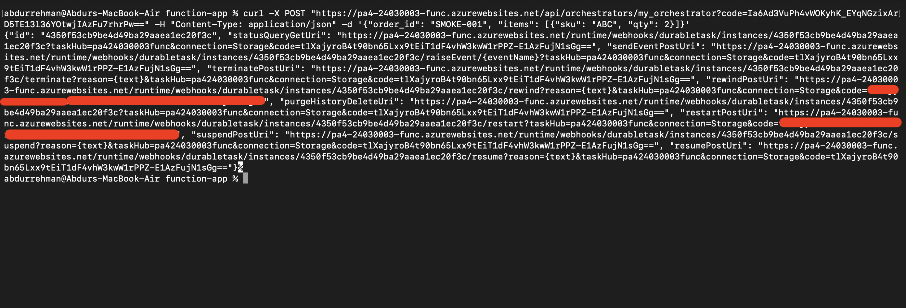

Description: The curl POST to the HTTP starter returned an `id` and `statusQueryGetUri`, proving the Function App is running, accepting requests, and the Durable orchestration started successfully.

### Evidence 4.4: Expected Failed Status Before Downstream Wiring

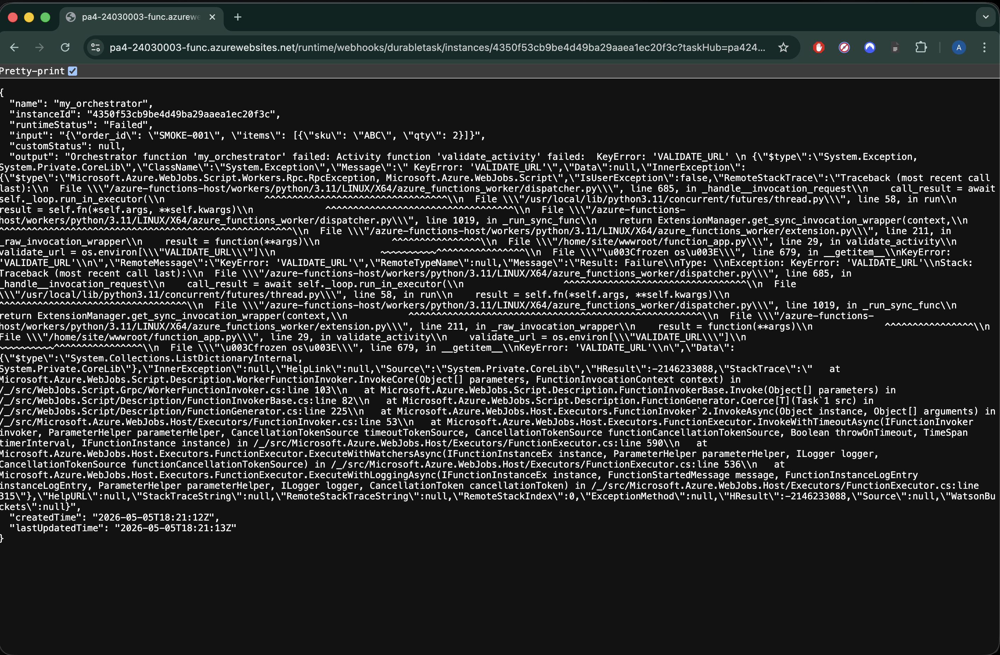

Description: Polling the `statusQueryGetUri` shows `runtimeStatus: Failed` with error `KeyError: 'VALIDATE_URL'`. This is expected at this stage because the AKS validator has not been deployed yet and `VALIDATE_URL` is not configured. It proves the orchestrator started, checkpointed, and reached `validate_activity` successfully.

---

## Task 5: AKS Validator (15 points)

### Evidence 5.1: AKS Cluster

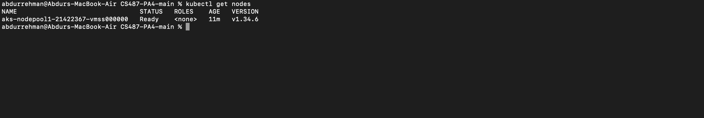

Description: The AKS cluster `pa4-24030003` is provisioned in resource group `rg-sp26-24030003`, UK West region, with 1 node of size `Standard_B2s`.

### Evidence 5.2: Kubernetes Nodes and Pods

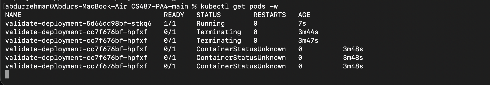

Description: `kubectl get nodes` shows one node in Ready state.

### Evidence 5.3: Kubernetes Service

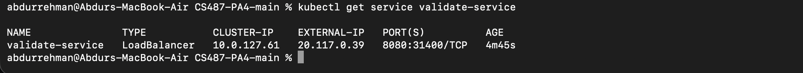

Description: The `validate-service` LoadBalancer has been assigned external IP `20.117.0.39` on port 8080.

### Evidence 5.4: Validator API Tests

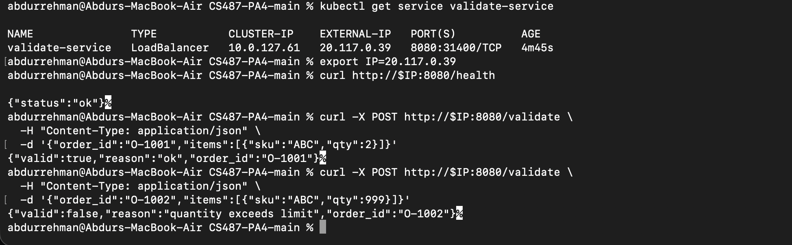

Description: Three tests confirm the validator works correctly: `/health` returns a healthy status, a valid order with `qty=2` returns `{"valid": true, "reason": "ok"}`; an invalid order with `qty=999` returns `{"valid": false, "reason": "quantity exceeds limit"}` as expected.

### Evidence 5.5: Function App `VALIDATE_URL`

Description: The Function App application setting `VALIDATE_URL` is set to `http://20.117.0.39:8080/validate`, pointing the `validate_activity` to the AKS LoadBalancer external IP.

---

## Task 6: ACI Report Job (15 points)

### Evidence 6.1: Blob Container

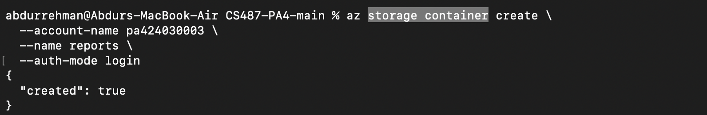

Description: The `reports` blob container was created in storage account `pa424030003`.

### Evidence 6.2: Manual ACI Run

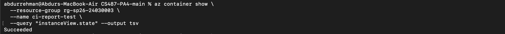

Description: The `az container show` output for `ci-report-test` shows `instanceView.state: Succeeded`.

### Evidence 6.3: ACI Logs

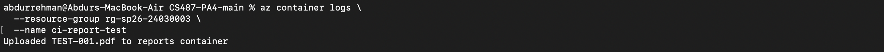

Description: The `az container logs` output shows `Uploaded TEST-001.pdf to reports container`, confirming the report-job container successfully generated and uploaded the PDF to Blob Storage before exiting.

### Evidence 6.4: Generated PDF

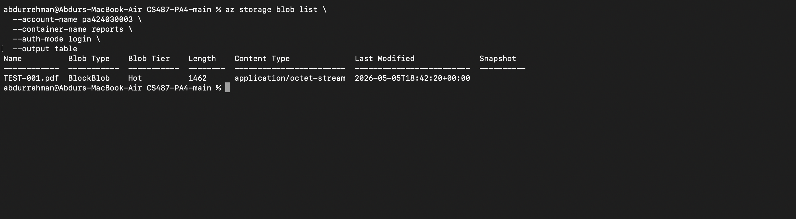

Description: The `az storage blob list` output shows `TEST-001.pdf` in the `reports` container with content type `application/octet-stream`. This confirms the ACI report-job wrote the PDF to Blob Storage successfully.

### Evidence 6.5: Function App Managed Identity and IAM

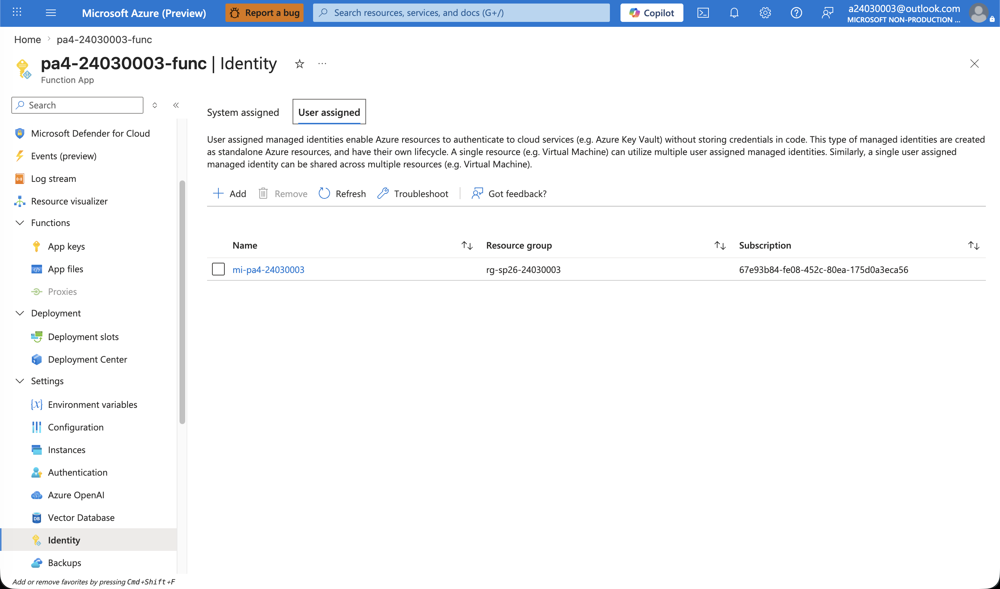

Description: The Function App Identity blade shows the user-assigned managed identity `mi-pa4-24030003` attached.
### Evidence 6.6: Report App Settings

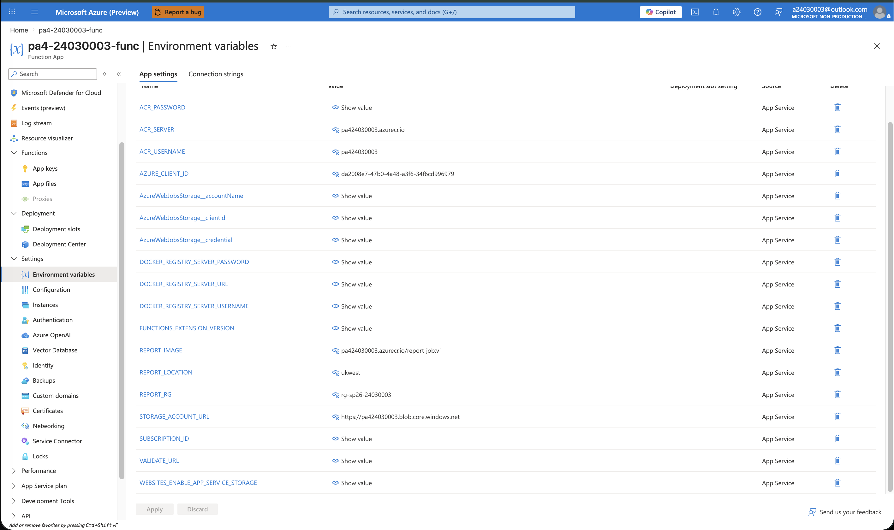

Description: The Function App shows `REPORT_IMAGE`, `REPORT_RG`, `REPORT_LOCATION`, `ACR_SERVER`, `ACR_USERNAME`, `STORAGE_ACCOUNT_URL`, `SUBSCRIPTION_ID`, and `AZURE_CLIENT_ID` configured. ACR password is masked.
---

## Task 7: End-to-End Pipeline (15 points)

### Evidence 7.1: Happy Path UI

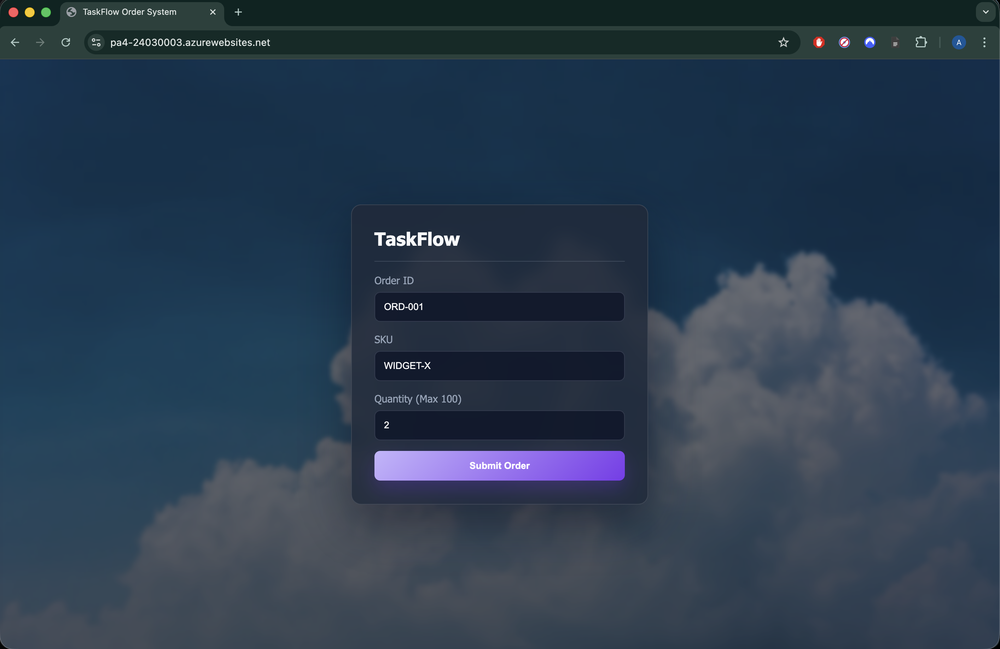

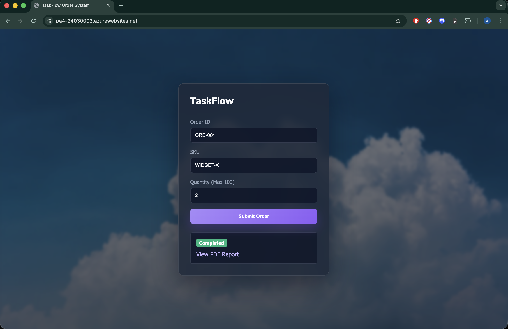
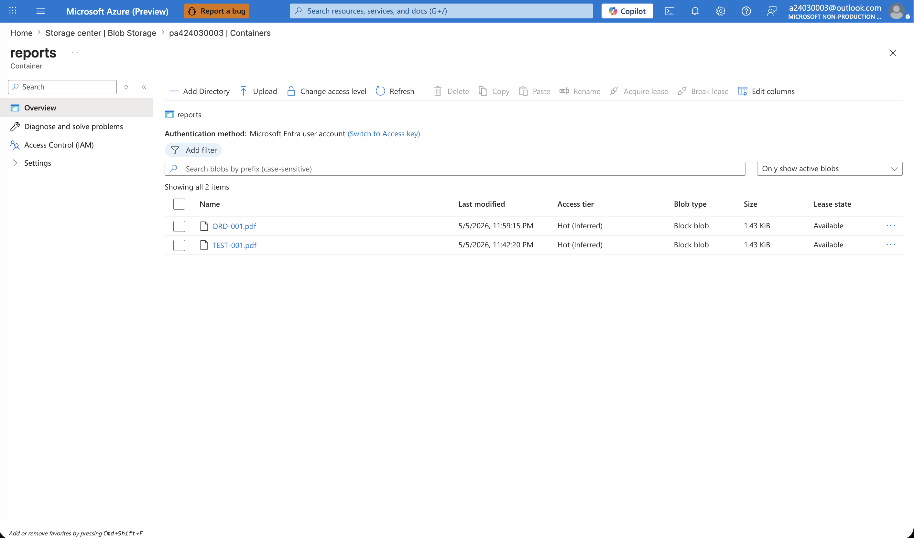
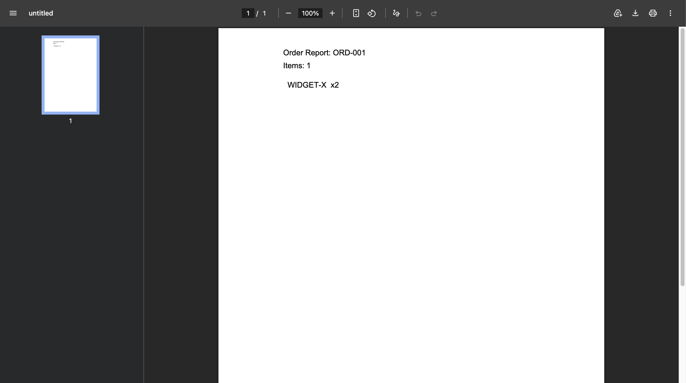

Description: An order with `order_id=ORD-001`, `sku=WIDGET-X`, and `qty=2` was submitted. The UI showed Running with an instance ID, then transitioned to Completed with a report URL link. The PDF was downloaded and opened successfully, confirming the full pipeline executed end-to-end.

### Evidence 7.2: Backend Participation

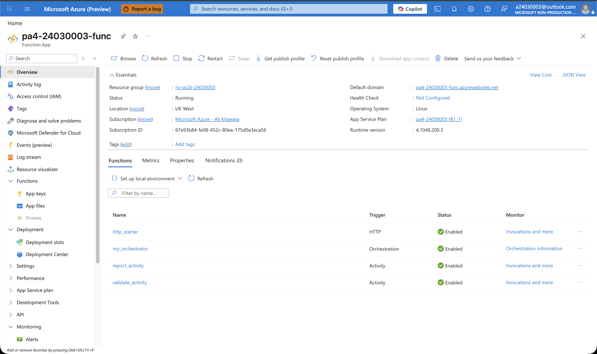
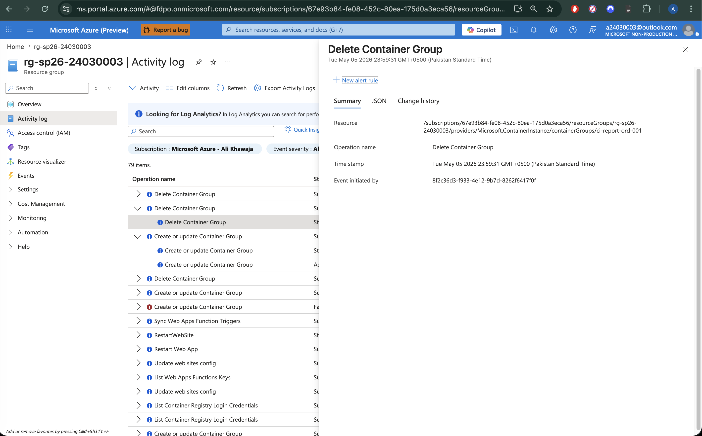
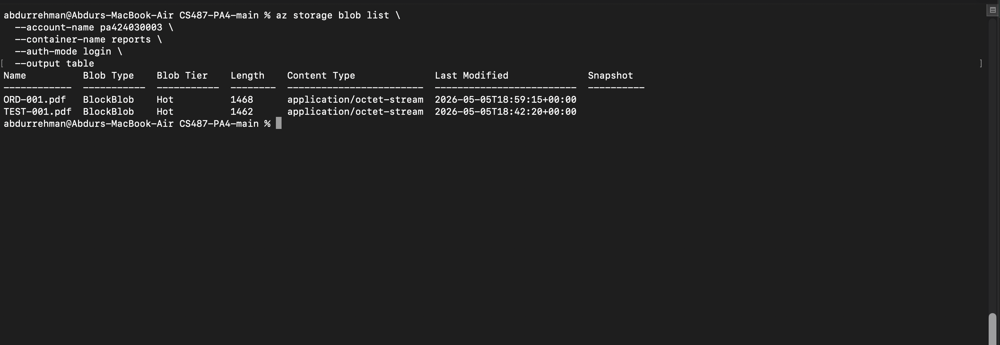
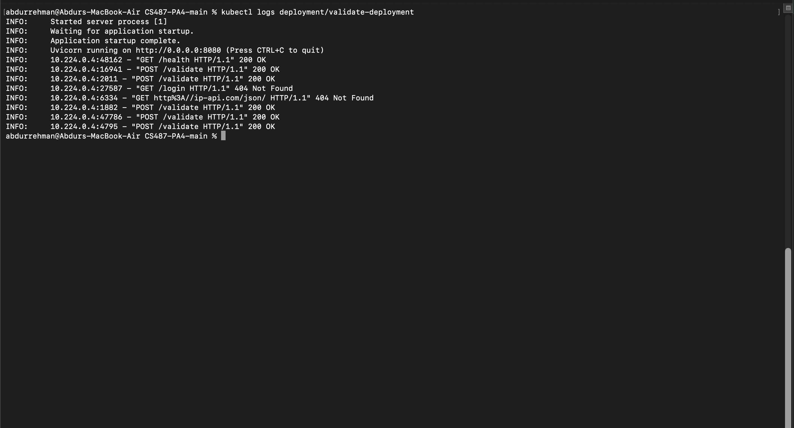

Description: Function App Monitor shows invocations for `http_starter`, `my_orchestrator`, `validate_activity`, and `report_activity`. The Azure Activity Log shows the ACI was created and deleted during the run. The blob container shows `ORD-001.pdf`. AKS pod logs show the POST `/validate` request received during the run.

### Evidence 7.3: Reject Path UI

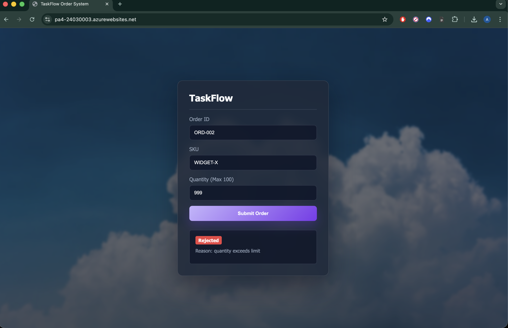
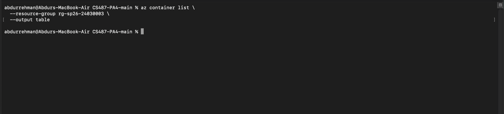
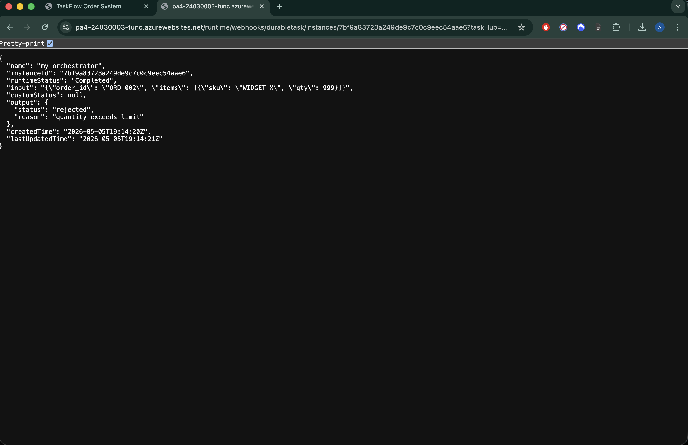

Description: An order with `qty=999` was submitted. The UI showed the rejection message with reason `quantity exceeds limit`. The `az container list` output was empty, proving no ACI was spawned. The orchestration status query shows `runtimeStatus: Completed` with output `{"status": "rejected"}`, confirming the orchestrator short-circuited correctly after the validator rejected the order.

### Evidence 7.4: Resource Group Overview

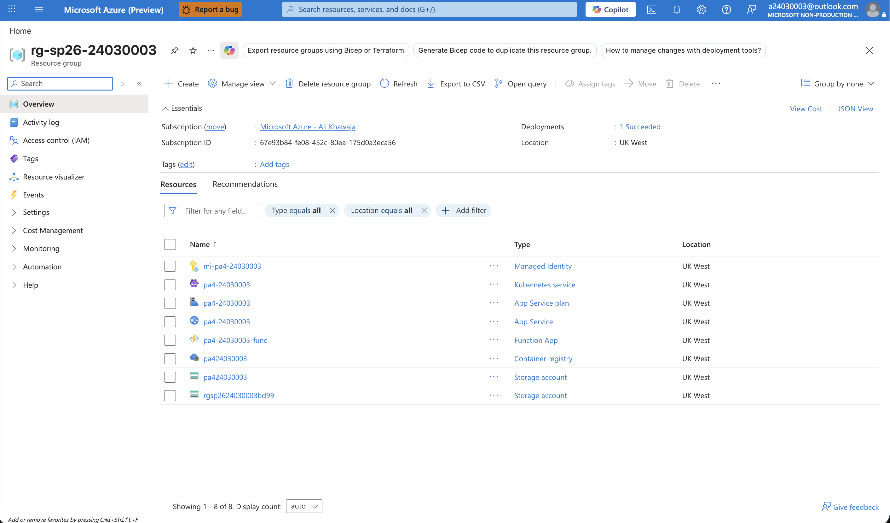

Description: The resource group `rg-sp26-24030003` shows all deployed resources in UK West region.

---

## Task 8: Write-up and Architecture Diagram (5 points)

### Evidence 8.1: Architecture Diagram

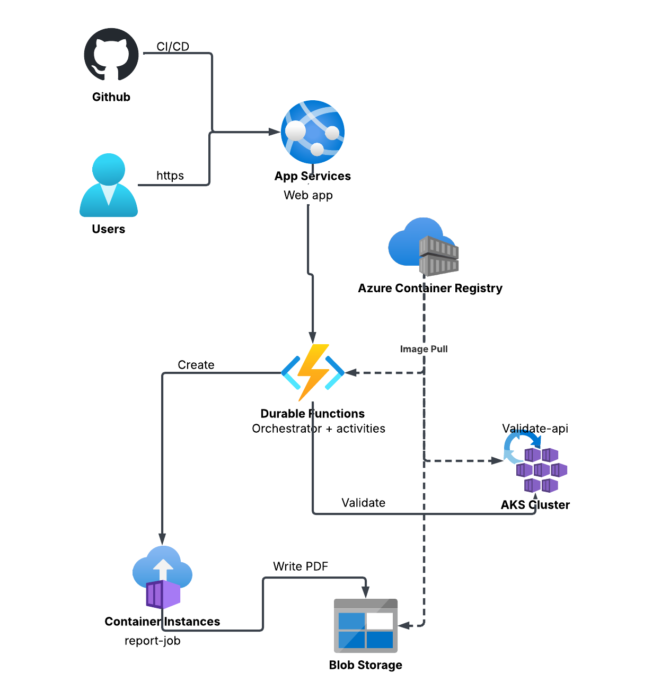

Description: The diagram shows all Azure resources and their relationships: GitHub CI/CD to App Service, Web App to Function App (start + poll), Function App to AKS (validate HTTP call), Function App to ACI (SDK-based ephemeral creation), ACI to Blob Storage (PDF write), and ACR providing images to all three container services.

### Question 8.2: Service Selection

**App Service** is the right choice for the TaskFlow web UI because it provides always on hosting with zero cold start, native CI/CD integration with GitHub, and a stable HTTPS endpoint.

**Durable Functions** is the correct orchestration layer because the pipeline involves multiple sequential steps that can take over a minute combined. Plain HTTP functions have a 230 second timeout and no built in state persistence, if the report step fails, the entire flow would need to restart from scratch. Durable Functions checkpoints state after each activity, so a failure in `report_activity` does not re-run `validate_activity`, and the orchestration can resume exactly where it left off.

**Azure Kubernetes Service** is appropriate for the validator because it is a long lived HTTP microservice that must respond within milliseconds to every order. AKS provides a stable LoadBalancer endpoint, always-running pods with no cold start.

**Azure Container Instances** is the right choice for the report job because it is a short lived batch task that runs for ~20 seconds per order. ACI bills only during container runtime, so there is zero idle cost between orders.

### Question 8.3: ACI vs AKS

**AKS idle behavior:** The AKS node (`Standard_B2s`) continues running and billing even when no orders are being processed. There is no scale to zero on a single node cluster, the node stays in Ready state and the validator pod keeps running.

**ACI idle behavior:** ACI has no concept of idle. The report job container does not exist between orders, `report_activity` creates it on demand, it runs for ~20 seconds, and `begin_delete` removes it immediately.

**Cost under spam (1000 orders/minute):** AKS would handle the spike on the existing node with minimal extra cost since the node is already running. ACI would spawn up to 1000 concurrent container instances, each billing per second, the cost could be significant. However, AKS would still be cheaper overall for this scenario because the report job is short lived.

### Question 8.4: Durable Functions vs Plain HTTP

If the same flow were implemented as two plain HTTP functions calling each other, two concrete problems would arise. First, function timeouts, Second, state persistence. Durable Functions solves both by returning immediately with a status URL and checkpointing each activity result, allowing resumption from the exact failure point.

### Question 8.5: Cost Review

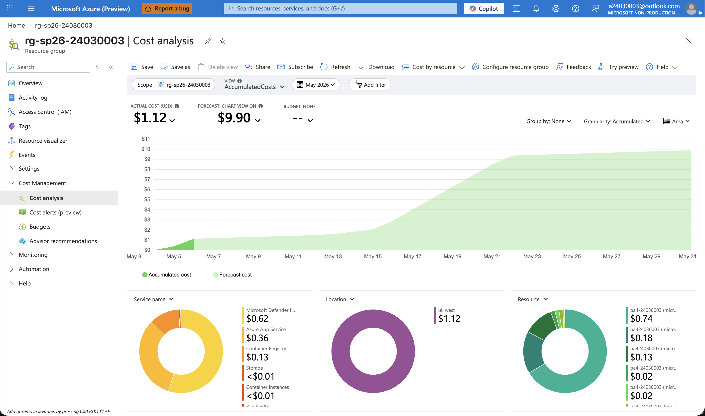

Description: The Cost Management analysis scoped to `rg-sp26-24030003` shows the AKS cluster as the single most expensive resource due to the `Standard_B2s` node running continuously for the duration of the assignment.

### Question 8.6: Challenges Faced

**Challenge 1 — Apple Silicon platform mismatch:** When building Docker images on the MacBook (ARM64 architecture) without the `--platform linux/amd64` flag, Azure rejected the images. The fix was to add `--platform linux/amd64` to every `docker build` command, forcing the build to produce AMD64 images compatible with Azure's Linux nodes.

**Challenge 2 — Key-based authentication blocked on Storage Account:** The auto-created Storage Account for the Function App had key-based authentication disabled by the subscription's security policy, causing `KeyBasedAuthenticationNotPermitted`. The fix was to delete the `AzureWebJobsStorage` connection string setting and replace it with three managed identity settings: `AzureWebJobsStorage__accountName`, `AzureWebJobsStorage__credential=managedidentity`, and `AzureWebJobsStorage__clientId`.

**Challenge 3 — Function App name conflict:** The naming convention in the assignment specified the same name `pa4-24030003` for both the Web App and the Function App. Since Azure App Service names must be globally unique DNS names, creating the Function App with the same name failed. The Function App was deployed as `pa4-24030003-func` instead.

---
